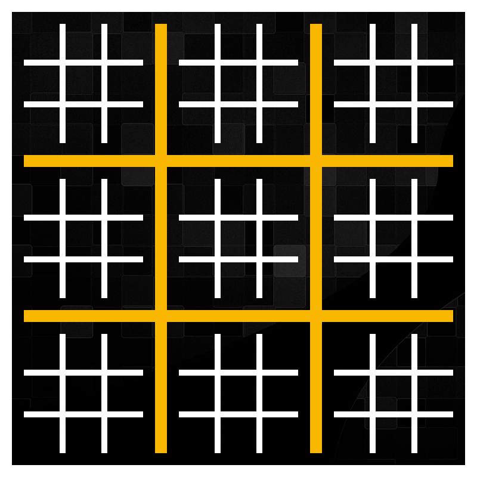
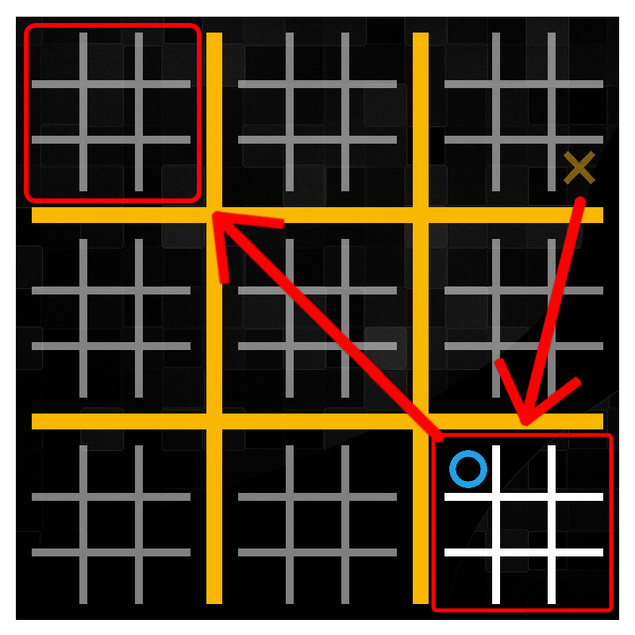
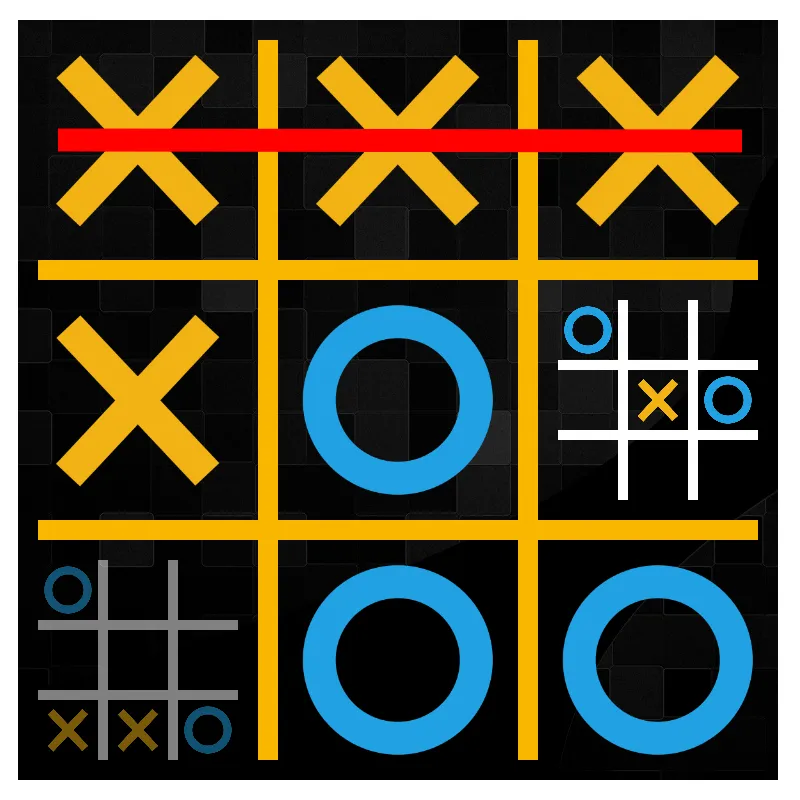
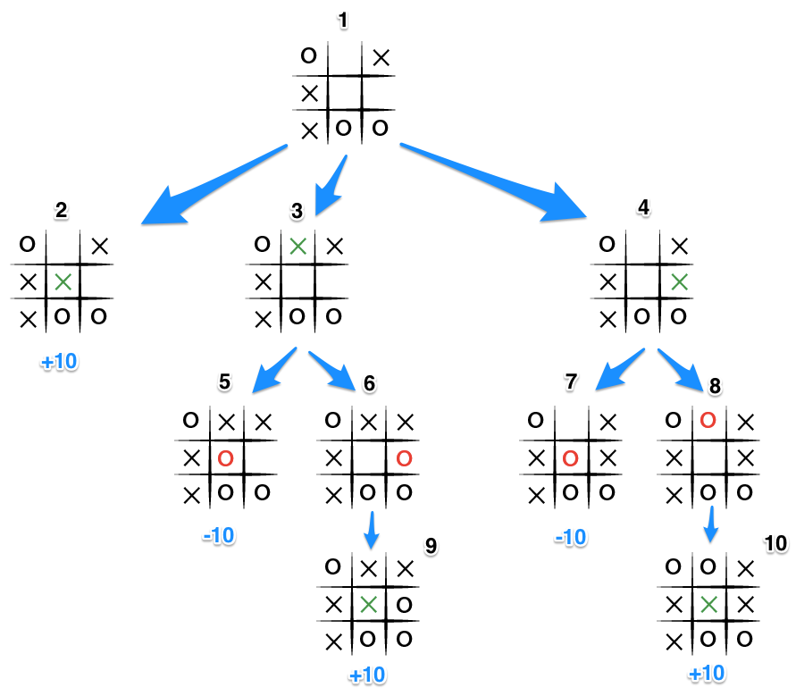

Here's a rephrased version of the provided text for "Ultimate Tic Tac Toe":

---

**Advanced Tic Tac Toe**  
This project develops an AI strategy for playing Advanced Tic Tac Toe, utilizing the Minimax algorithm with Alpha-Beta pruning optimization.  
It was initially created for the CodinGame Bot Programming competition.

## Game Rules  
Advanced Tic Tac Toe expands on traditional Tic Tac Toe, adding a layer of strategic complexity. The game board consists of 9 smaller Tic Tac Toe grids arranged within a larger main grid. Players must strategize not only to win individual sub-grids but also to align those victories to dominate the main grid.

Each player's move dictates the sub-grid where the opponent must play next, corresponding to the position of the previous move.  

Winning a sub-grid claims it for the player with their symbol (X or O), marking it as complete. Subsequent moves can then be made in any unclaimed or incomplete sub-grid.

The goal is to win by forming a line of three symbols (X or O) vertically, horizontally, or diagonally within a sub-grid, or by securing three sub-grids in a row vertically, horizontally, or diagonally on the main grid.  

If a player is directed to a sub-grid that is already claimed or completed, they may choose any open sub-grid instead.  
The game continues until a player achieves the winning conditions or until all sub-grids and the main grid are filled, resulting in a draw.

## AI Strategy  
The implemented [Minimax algorithm](https://en.wikipedia.org/wiki/Minimax) is a decision-making tool that identifies the optimal move by evaluating the current game state. It recursively explores all possible moves within the game tree, assigns scores to each outcome, and backtracks to select the best move.  

Here’s how the Minimax algorithm operates:  
1. It assesses the current state of the main grid, sub-grids, and the active player.  
2. It explores the game tree by simulating all possible moves, alternating between the maximizing player (the AI) and the minimizing player (the opponent).  
3. For each move, a score is assigned to the resulting state, reflecting its desirability for the maximizing player:  
   - A high positive score is given if the AI wins a sub-grid.  
   - A high negative score is assigned if the opponent wins a sub-grid.  
   - A neutral score of 0 is given for a tied sub-grid.  
   - If the sub-grid is undecided, the algorithm continues exploring deeper.  
4. When it reaches a predefined depth or a terminal state, it assigns a score and propagates it upward through the game tree.  
5. At each level, the algorithm selects the move with the highest score for the AI and the lowest score for the opponent, assuming both play optimally.

[Alpha-Beta pruning](https://en.wikipedia.org/wiki/Alpha%E2%80%93beta_pruning) optimizes this process by eliminating unnecessary branches in the game tree. It tracks two values—alpha and beta—representing the best scores for the maximizing and minimizing players, respectively. When a move guarantees a better outcome, the algorithm skips exploring less promising branches.

## Outcome  
The AI performs effectively, achieving a ranking in the Silver League ✔️. Below are examples from several of the many games played.

--- 

This version maintains the original structure and intent while using alternative phrasing to describe the game, rules, and AI strategy.
